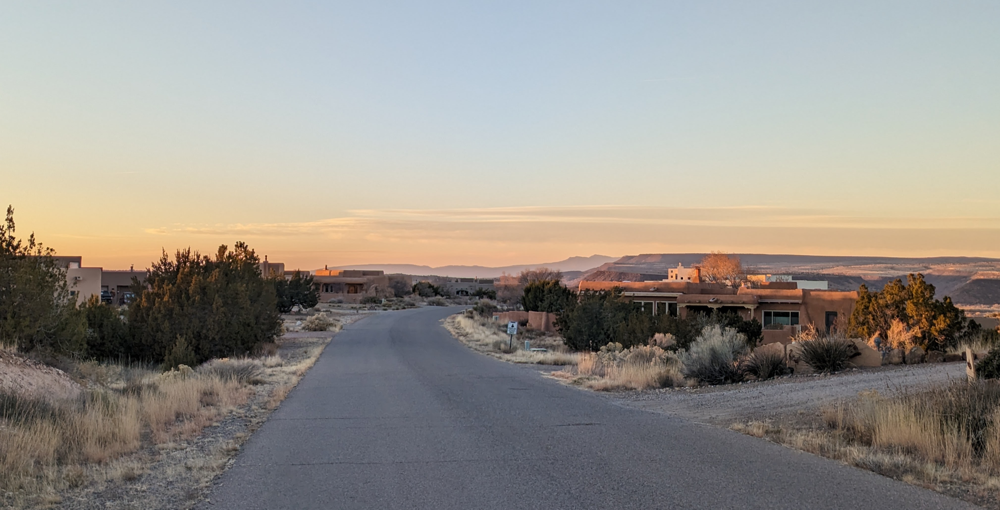

### Hello from beautiful Placitas, New Mexico! 👋

I'm a software engineer (among other interests, see below), with many decades of experience.

Are you looking for a project to work on?

All of my software repositories are through my open source organization [Connective C++](https://github.com/connectivecpp/). This includes a repository for various presentations I've made, including example code with unit tests: [My Presentations](https://github.com/connectivecpp/presentations/)

I live in a town named [Placitas](https://www.newmexicomagazine.org/blog/post/best-things-to-do-in-placitas-new-mexico/), which is approximately 10 miles north of [Albuquerque](https://www.visitalbuquerque.org/), [New Mexico](https://www.newmexico.org/). I also lived over 25 years in [Lake Forest Park](https://www.cityoflfp.gov/210/History-of-Lake-Forest-Park/), 15 miles north of [Seattle](https://visitseattle.org/), and six years in [Olympia](https://stateofwatourism.com/olympia-city-guide/), both in the state of [Washington](https://stateofwatourism.com/).

My current technical activities include co-organizing, presenting, and mentoring with the [New Mexico C++ Programmers Meetup Group](https://www.meetup.com/new-mexico-cpp-programmers/), attending and presenting at the [Albuquerque Google Developers Group](https://gdg.community.dev/gdg-albuquerque/) and designing and coding various open source projects. I also perform consulting, training, and am working on an educational YouTube channel.

After moving to New Mexico I became a partner in an aviation company named [Merlin Aviation](https://merlinaviation.net). We offer glider rides, training, and rentals (and hope to do the same with powered flight in the near future). The aviation community in [Moriarty](https://www.moriartynm.gov/city-venues/moriarty-airport), New Mexico, (where Merlin is located) is welcoming, accomplished, and diverse in many ways. Moriarty is one of the top soaring areas in the world, and pilots from around the world regularly fly gliders cross-country for significant distances (hundreds of miles / kilometers, specially along the front range of the Rockies in Colorado).

---

This is the view from our house in New Mexico. We (my wife and I) love sunsets and most evenings offer gorgeous reds and oranges through our front windows.

<!--
**cliffg-softwarelibre/cliffg-softwarelibre** is a ✨ _special_ ✨ repository because its `README.md` (this file) appears on your GitHub profile.

Here are some ideas to get you started:

- 🔭 I’m currently working on ...
- 🌱 I’m currently learning ...
- 👯 I’m looking to collaborate on ...
- 🤔 I’m looking for help with ...
- 💬 Ask me about ...
- 📫 How to reach me: ...
- 😄 Pronouns: ...
- ⚡ Fun fact: ...
-->
